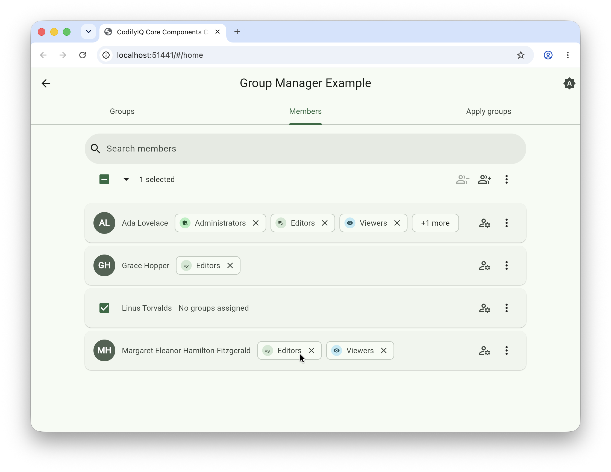

# codifyiq_group_manager

[](https://pub.dev/packages/codifyiq_group_manager)

Material 3 widgets for managing **flat authorization groups** and assigning one or more of them
to users. Groups are intentionally simple — no nesting and no separate roles. A principal (a user,
service account, or any subject you authorize) is just assigned one or more groups, and your app
derives whatever permissions it likes from that membership.

This package is **UI-only**: it never talks to a backend. You drive the controller and wire its
mutations to your own persistence layer.

## Demo
Select the image for a quick walkthrough:
[](https://drive.google.com/file/d/11Kb3FZqaKzMKWFLSPF_mIM9kMpE-R33O/view?usp=drive_link)

## Installation

```yaml
dependencies:
  codifyiq_group_manager: ^1.1.0
```

## Concepts

| Piece | Role |
|---|---|
| `Group` | Immutable group model (id, name, optional description/color/icon). |
| `GroupColor` | Theme-derived accent role (resolves against `ColorScheme`). |
| `GroupManagerController` | UI-only state container for the catalog and assignments. |
| `GroupManagerScope` | Inherited notifier exposing the controller to a subtree. |
| `GroupManagerView` | Drop-in catalog screen (create / edit / delete + search). |
| `GroupListView` | The catalog list, controller-driven, with edit/delete + filter. |
| `GroupAssignmentField` | Assign groups to any target (user, folder, …) — chips + searchable add picker. |
| `GroupPicker` | Searchable multi-select picker — adaptive bottom sheet / dialog. |
| `GroupBulkAssignmentDialog` | Pick groups to add to many principals at once (host selects the principals). |
| `BulkSelectionBar` | Fixed-height selection toolbar (select all/none + bulk actions) for any list — no `Group` dependency. |
| `GroupEditorDialog` / `GroupChip` / `GroupAvatar` | Composable building blocks. |

## Usage

### Manage the catalog

```dart
final controller = GroupManagerController(
  groups: const [
    Group(id: 'admins', name: 'Administrators', icon: Icons.admin_panel_settings),
    Group(id: 'editors', name: 'Editors'),
  ],
);

// Drop the full management surface into a Scaffold body:
Scaffold(body: GroupManagerView(controller: controller));
```

`GroupManagerView` (and `GroupListView`) handle create, edit, and delete against the controller,
and `GroupManagerView` includes a search field that filters the catalog once it has groups.
Deleting a group cascades — it is also unassigned from every member.

### Group colors follow the theme

A group's accent is a `GroupColor` role (`primary`, `secondary`, `tertiary`, `neutral`) resolved
against the active `ColorScheme` at render time — so it harmonizes with your app and adapts to
light/dark automatically. Leave `Group.color` `null` to auto-assign a stable role per group:

```dart
const Group(id: 'admins', name: 'Administrators', color: GroupColor.primary);
const Group(id: 'editors', name: 'Editors'); // auto-derived, stable per id
```

### Assign groups to a user

`GroupAssignmentField` is value-driven, so wire it to the controller from your form:

```dart
ListenableBuilder(
  listenable: controller,
  builder: (context, _) => GroupAssignmentField(
    label: 'Groups',
    groups: controller.groups,
    selected: controller.groupsFor(userId),
    onChanged: (ids) => controller.setAssignments(userId, ids),
  ),
);
```

### Assign groups to any object (folder, document, project, …)

The field is target-agnostic, and assignments are keyed by any id you choose — so
the same field attaches groups to a folder just as well as to a user. Key the
assignment by the object's id, and offer a **scoped subset** of groups to limit
choices — for example, only the groups the signed-in user belongs to (what they
are allowed to grant):

```dart
GroupAssignmentField(
  label: folder.name,
  groups: controller.resolvedGroupsFor(currentUserId), // only what I can grant
  selected: controller.groupsFor('folder:${folder.id}'),
  onChanged: (ids) => controller.setAssignments('folder:${folder.id}', ids),
  pickerTitle: 'Share "${folder.name}" with your groups',
);
```

### Bulk-add or bulk-remove groups for many users at once

When the host app already lets someone multi-select users elsewhere (checked
rows in a table, for example), `GroupBulkAssignmentDialog` picks the groups to
add to — or remove from — all of them in one action:

```dart
final toAdd = await GroupBulkAssignmentDialog.show(
  context,
  groups: controller.groups,
  principalCount: selectedUserIds.length,
);
if (toAdd != null) controller.assignMany(selectedUserIds, toAdd);
```

`GroupManagerController.assignMany` applies the result additively — existing
memberships are untouched. For removal, scope the offered `groups` to what's
worth removing (typically the union of groups actually held by the selected
users), and apply the result with `unassignMany`:

```dart
final heldByAnySelected = {
  for (final id in selectedUserIds) ...controller.groupsFor(id),
};
final toRemove = await GroupBulkAssignmentDialog.showRemoval(
  context,
  groups: controller.groups.where((g) => heldByAnySelected.contains(g.id)).toList(),
  principalCount: selectedUserIds.length,
  lockedIds: lockedGroups, // e.g. "Administrators" — never bulk-removable
);
if (toRemove != null) controller.unassignMany(selectedUserIds, toRemove);
```

Pass `lockedIds` to `showRemoval` for any group that must never be bulk-removed — unlike
`GroupPicker.lockedIds` elsewhere (which shows a locked group checked-and-disabled, always
included in the result), `showRemoval` drops locked groups from the offered list entirely, since
"checked and always included" here would mean "always removed".

### Driving that bulk selection from a toolbar

`BulkSelectionBar` is the selector that drives `selectedUserIds` above — a Gmail-style tristate
checkbox + "All"/"None" dropdown, plus bulk-action buttons that stay hidden (space reserved, no
list reflow) until something's selected. It has no dependency on `Group` — pair it with any list:

```dart
BulkSelectionBar(
  selectedCount: selectedUserIds.length,
  allVisibleSelected: visibleUsers.isNotEmpty &&
      visibleUsers.every((u) => selectedUserIds.contains(u.id)),
  onSelectAll: (choice) => setState(() {
    if (choice == BulkSelectAll.all) {
      selectedUserIds.addAll(visibleUsers.map((u) => u.id));
    } else {
      selectedUserIds.clear();
    }
  }),
  actions: [
    IconButton(
      tooltip: 'Add groups',
      onPressed: () => bulkAssign(context),
      icon: const Icon(Icons.group_add_outlined),
    ),
  ],
);
```

### Collapsing chips in a dense list

When rendering `GroupAssignmentField` for many targets at once (e.g. a member
list), cap how many chips show per row with `maxVisibleChips` — the rest
collapse behind a "+N more" chip that expands in place:

```dart
GroupAssignmentField(
  label: user.name,
  groups: controller.groups,
  selected: controller.groupsFor(user.id),
  onChanged: (ids) => controller.setAssignments(user.id, ids),
  maxVisibleChips: 3,
);
```

For a denser, grid-like list — label, chips, and the edit button all on one
row per target — add `singleLine: true`. As many chips as fit the available
width are shown (further capped by `maxVisibleChips` if also set):

```dart
GroupAssignmentField(
  label: user.name,
  groups: controller.groups,
  selected: controller.groupsFor(user.id),
  onChanged: (ids) => controller.setAssignments(user.id, ids),
  singleLine: true,
);
```

### Ambient access via scope

```dart
GroupManagerScope(
  controller: controller,
  child: MyApp(),
);

// Anywhere below:
GroupManagerScope.of(context).assign(userId, 'admins');
```

---

Part of the [CodifyIQ component family](https://github.com/CodifyIQ/codifyiq-core-components) · [pub.dev/publishers/codifyiq.com](https://pub.dev/publishers/codifyiq.com)
