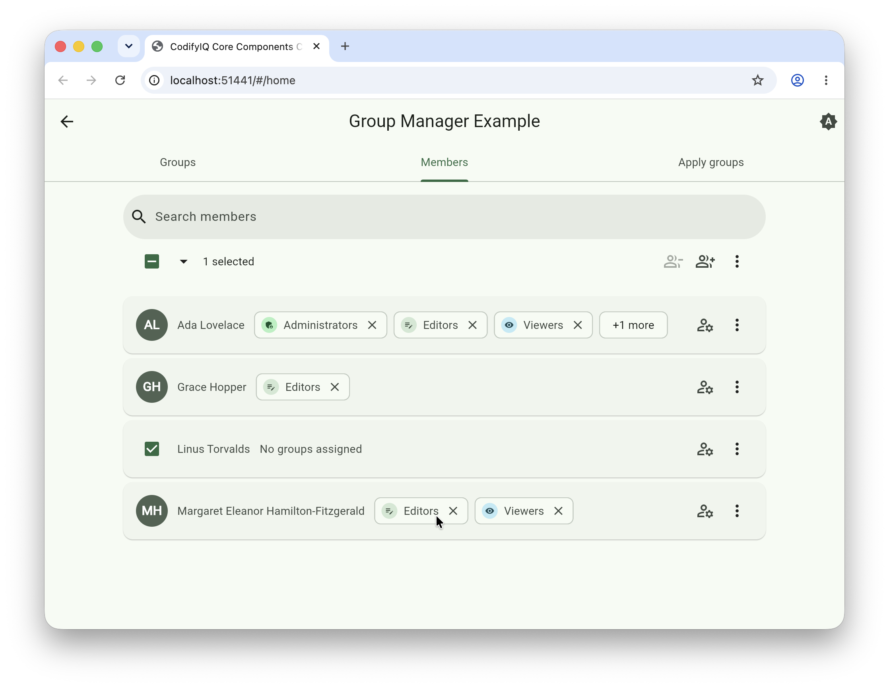

# codifyiq_group_manager

[](https://pub.dev/packages/codifyiq_group_manager)

Material 3 widgets for managing **flat authorization groups** and their membership — worked from
either end: assign groups to a user, or add members to a group. Groups are intentionally simple —
no nesting, and a group carries no role of its own. A principal (a user, service account, or any
subject you authorize) is just assigned one or more groups, and your app derives whatever
permissions it likes from that membership. When you do need roles, they qualify an *assignment*
(see [Qualify an assignment with a role](#qualify-an-assignment-with-a-role)).

This package is **UI-only**: it never talks to a backend. You drive the controller and wire its
mutations to your own persistence layer.

## Demo
Select the image for a quick walkthrough:
[](https://drive.google.com/file/d/11Kb3FZqaKzMKWFLSPF_mIM9kMpE-R33O/view?usp=drive_link)

## Installation

```yaml
dependencies:
  codifyiq_group_manager: ^2.0.0
```

## Concepts

| Piece | Role |
|---|---|
| `Group` | Immutable group model (id, name, optional description/color/icon). |
| `Principal` | Immutable member model (id, name, optional description/photo/icon). A photo can be a URL or an `ImageProvider`. |
| `GroupColor` | Theme-derived accent role (resolves against `ColorScheme`). |
| `AssignmentRole` | Optional role an assignment carries (id, label, optional description), e.g. "Can edit". |
| `GroupManagerController` | UI-only state container for the catalog and assignments. |
| `GroupManagerScope` | Inherited notifier exposing the controller to a subtree. |
| `GroupManagerView` | Drop-in catalog screen (create / edit / delete + search). |
| `GroupListView` | The catalog list, controller-driven, with edit/delete + filter. |
| `BulkSelectionBar` | Fixed-height selection toolbar (select all/none + bulk actions) for any list — no `Group` dependency. |
| `GroupEditorDialog` / `GroupChip` / `GroupAvatar` / `PrincipalChip` / `PrincipalAvatar` | Composable building blocks. |

Membership is one relation you can edit from **either end**, and every piece has a mirror:

| Groups for a member | Members of a group |
|---|---|
| `GroupAssignmentField` — chips + picker | `MemberAssignmentField` — chips + picker |
| `GroupPicker` | `MemberPicker` |
| `GroupManagerView` (the catalog) | `GroupMembersView` (one group's roster) |
| `GroupBulkAssignmentDialog` | *(covered by `MemberPicker`)* |
| `controller.groupsFor(id)` / `setAssignments` | `controller.membersOf(id)` / `setMembers` |

Both sides read and write the same data, so an edit made from one is immediately visible from
the other.

## Usage

### Manage the catalog

```dart
final controller = GroupManagerController(
  groups: const [
    Group(id: 'admins', name: 'Administrators', icon: Icons.admin_panel_settings),
    Group(id: 'editors', name: 'Editors'),
  ],
);

// Drop the full management surface into a Scaffold body:
Scaffold(body: GroupManagerView(controller: controller));
```

`GroupManagerView` (and `GroupListView`) handle create, edit, and delete against the controller,
and `GroupManagerView` includes a search field that filters the catalog once it has groups.
Deleting a group cascades — it is also unassigned from every member.

### Group colors follow the theme

A group's accent is a `GroupColor` role (`primary`, `secondary`, `tertiary`, `neutral`) resolved
against the active `ColorScheme` at render time — so it harmonizes with your app and adapts to
light/dark automatically. Leave `Group.color` `null` to auto-assign a stable role per group:

```dart
const Group(id: 'admins', name: 'Administrators', color: GroupColor.primary);
const Group(id: 'editors', name: 'Editors'); // auto-derived, stable per id
```

### Assign groups to a user

`GroupAssignmentField` is value-driven, so wire it to the controller from your form:

```dart
ListenableBuilder(
  listenable: controller,
  builder: (context, _) => GroupAssignmentField(
    label: 'Groups',
    groups: controller.groups,
    selected: controller.groupsFor(userId),
    onChanged: (ids) => controller.setAssignments(userId, ids),
  ),
);
```

### Add members to a group

The mirror of the above. `GroupMembersView` is the drop-in surface for one group's
membership — search, an "Edit members" picker, and per-row plus bulk removal —
typically reached by tapping a row in `GroupManagerView`:

```dart
GroupManagerView(
  controller: controller,
  onTap: (group) => Navigator.of(context).push(
    MaterialPageRoute(
      builder: (_) => Scaffold(
        appBar: AppBar(title: Text(group.name)),
        body: GroupMembersView(
          groupId: group.id,
          roster: allUsers, // your own List<Principal>
          controller: controller,
        ),
      ),
    ),
  ),
);
```

The **roster is yours to supply**. The controller stores principal ids, not people, so it
can't enumerate someone who belongs to no group yet — map your user type onto `Principal`
at the widget boundary:

```dart
final allUsers = [
  for (final user in myUsers)
    Principal(
      id: user.uid,
      name: user.displayName,
      description: user.email,
      imageUrl: user.photoUrl,
    ),
];
```

`PrincipalAvatar` is a thin wrapper over `UserAvatar` from
[codifyiq_user_avatar](../codifyiq_user_avatar) — it adds the group palette tint and the
service-account `icon`, and leaves photos, initials, and the person-glyph fallback to
`UserAvatar`. A user therefore looks the same here as on the rest of your screens, rather
than being a second interpretation of the same avatar. A photo that isn't a fetchable URL
goes on the `Principal` directly, in whichever shape you already hold it:

```dart
Principal(
  id: user.uid,
  name: user.displayName,
  photoBase64: user.photoBase64,   // or: photoBytes: user.photoBytes
);
```

Either can be built inline in `build` — the avatar owns the decode and reuses it while the
bytes are unchanged, and `Principal` compares bytes by value, so a member list doesn't
churn. `imageProvider` is still there for a `FileImage` or `AssetImage`; that one needs a
stable instance. For photos that *are* URLs behind an authenticated or cached endpoint,
pass `avatarHeaders` / `avatarImageProviderBuilder` to `GroupMembersView`, `MemberPicker`,
or `MemberAssignmentField` — the same builder you already use with `UserAvatar`.

For a single group inline on a form (rather than a whole screen), use
`MemberAssignmentField` — the exact counterpart of `GroupAssignmentField`, with the same
chips, `lockedIds`, `maxVisibleChips`, and `singleLine` options:

```dart
MemberAssignmentField(
  label: group.name,
  roster: allUsers,
  selected: controller.membersOf(group.id),
  onChanged: (ids) => controller.setMembers(group.id, ids),
);
```

`setMembers` rewrites only that group's membership — a principal removed from it keeps
every other group they belong to. Or reach for `MemberPicker.show` directly to build your
own affordance.

### Assign groups to any object (folder, document, project, …)

The field is target-agnostic, and assignments are keyed by any id you choose — so
the same field attaches groups to a folder just as well as to a user. Key the
assignment by the object's id, and offer a **scoped subset** of groups to limit
choices — for example, only the groups the signed-in user belongs to (what they
are allowed to grant):

```dart
GroupAssignmentField(
  label: folder.name,
  groups: controller.resolvedGroupsFor(currentUserId), // only what I can grant
  selected: controller.groupsFor('folder:${folder.id}'),
  onChanged: (ids) => controller.setAssignments('folder:${folder.id}', ids),
  pickerTitle: 'Share "${folder.name}" with your groups',
);
```

### Qualify an assignment with a role

When "assigned" isn't enough — this group can *view* the folder, that one can *edit* it — pass
`roles` to `GroupAssignmentField` (or `MemberAssignmentField`, e.g. owner vs member). Each chip
then reads `Engineering · Can edit ▾`, and tapping it opens a menu of the roles with the current
one checked:

```dart
const roles = [
  AssignmentRole(id: 'view', label: 'Can view'),
  AssignmentRole(id: 'edit', label: 'Can edit', description: 'Change files'),
  AssignmentRole(id: 'manage', label: 'Can manage', description: 'Edit and reshare'),
];

GroupAssignmentField(
  groups: groups,
  selected: shared,
  onChanged: (ids) => setState(() => shared = ids),
  roles: roles,
  rolesById: roleOf,            // current role id per selected group id
  defaultRoleId: 'view',        // role a newly picked group starts with
  onRoleChanged: (groupId, roleId) =>
      setState(() => roleOf = {...roleOf, groupId: roleId}),
);
```

The field stays value-driven: it never stores roles, it reports them. A pick from a chip's menu
calls `onRoleChanged`; groups added through the picker are reported through `onChanged` first,
then through `onRoleChanged` with `defaultRoleId`. Locked chips — and every chip when the field
is disabled — show their role but can't change it. A selected id missing from `rolesById` shows
no role but still opens the menu, so it can be given one; a role id not in `roles` shows the raw id. One role set applies to every chip in a
field. Roles are opaque to the package — what they mean, and enforcing them, is up to your app.
`GroupChip` and `PrincipalChip` take a `roleLabel` too, for read-only summaries.

`GroupMembersView` takes the same `roles` / `rolesById` / `defaultRoleId` / `onRoleChanged`, so
a group's own roster can show who is an owner and who is a member. Each row gains an `Owner ▾`
action beside Remove, and with members selected the selection bar offers **Set role** to apply one
role to the whole selection — which is why its `onRoleChanged` receives a `Set<String>` of ids
rather than one id. Locked members show their role but can't change it. A row of chips under the
search narrows the list to one role (combined with the search), and select-all and bulk actions
apply only to the members shown.

```dart
GroupMembersView(
  groupId: group.id,
  roster: allUsers,
  controller: controller,
  roles: const [
    AssignmentRole(id: 'owner', label: 'Owner'),
    AssignmentRole(id: 'member', label: 'Member'),
  ],
  rolesById: roleOf,            // current role id per member id
  defaultRoleId: 'member',      // role a newly added member starts with
  onRoleChanged: (ids, roleId) =>
      setState(() => roleOf = {...roleOf, for (final id in ids) id: roleId}),
);
```

### Bulk-add or bulk-remove groups for many users at once

When the host app already lets someone multi-select users elsewhere (checked
rows in a table, for example), `GroupBulkAssignmentDialog` picks the groups to
add to — or remove from — all of them in one action:

```dart
final toAdd = await GroupBulkAssignmentDialog.show(
  context,
  groups: controller.groups,
  principalCount: selectedUserIds.length,
);
if (toAdd != null) controller.assignMany(selectedUserIds, toAdd);
```

`GroupManagerController.assignMany` applies the result additively — existing
memberships are untouched. For removal, scope the offered `groups` to what's
worth removing (typically the union of groups actually held by the selected
users), and apply the result with `unassignMany`:

```dart
final heldByAnySelected = {
  for (final id in selectedUserIds) ...controller.groupsFor(id),
};
final toRemove = await GroupBulkAssignmentDialog.showRemoval(
  context,
  groups: controller.groups.where((g) => heldByAnySelected.contains(g.id)).toList(),
  principalCount: selectedUserIds.length,
  lockedIds: lockedGroups, // e.g. "Administrators" — never bulk-removable
);
if (toRemove != null) controller.unassignMany(selectedUserIds, toRemove);
```

Pass `lockedIds` to `showRemoval` for any group that must never be bulk-removed — unlike
`GroupPicker.lockedIds` elsewhere (which shows a locked group checked-and-disabled, always
included in the result), `showRemoval` drops locked groups from the offered list entirely, since
"checked and always included" here would mean "always removed".

### Driving that bulk selection from a toolbar

`BulkSelectionBar` is the selector that drives `selectedUserIds` above — a Gmail-style tristate
checkbox + "All"/"None" dropdown, plus bulk-action buttons that stay hidden (space reserved, no
list reflow) until something's selected. It has no dependency on `Group` — pair it with any list:

```dart
BulkSelectionBar(
  selectedCount: selectedUserIds.length,
  allVisibleSelected: visibleUsers.isNotEmpty &&
      visibleUsers.every((u) => selectedUserIds.contains(u.id)),
  onSelectAll: (choice) => setState(() {
    if (choice == BulkSelectAll.all) {
      selectedUserIds.addAll(visibleUsers.map((u) => u.id));
    } else {
      selectedUserIds.clear();
    }
  }),
  actions: [
    IconButton(
      tooltip: 'Add groups',
      onPressed: () => bulkAssign(context),
      icon: const Icon(Icons.group_add_outlined),
    ),
  ],
);
```

### Collapsing chips in a dense list

When rendering `GroupAssignmentField` for many targets at once (e.g. a member
list), cap how many chips show per row with `maxVisibleChips` — the rest
collapse behind a "+N more" chip that expands in place:

```dart
GroupAssignmentField(
  label: user.name,
  groups: controller.groups,
  selected: controller.groupsFor(user.id),
  onChanged: (ids) => controller.setAssignments(user.id, ids),
  maxVisibleChips: 3,
);
```

For a denser, grid-like list — label, chips, and the edit button all on one
row per target — add `singleLine: true`. As many chips as fit the available
width are shown (further capped by `maxVisibleChips` if also set):

```dart
GroupAssignmentField(
  label: user.name,
  groups: controller.groups,
  selected: controller.groupsFor(user.id),
  onChanged: (ids) => controller.setAssignments(user.id, ids),
  singleLine: true,
);
```

### Permanent groups and permanent members

Some memberships must not be editable away — an "Administrators" group your
assignments depend on, or a group's own owner. Pass `lockedIds` to
`GroupAssignmentField`, `GroupPicker`, `GroupManagerView`, and `GroupListView`,
or `lockedMemberIds` to `GroupMembersView` and `MemberAssignmentField`:

```dart
GroupMembersView(
  groupId: group.id,
  roster: allUsers,
  controller: controller,
  lockedMemberIds: {group.ownerId},
);
```

A locked entry shows a lock glyph in place of its remove affordance, appears
checked-and-disabled in the picker, is excluded from bulk removal, and is
always present in the resulting selection. In the catalog, a locked group's row
offers no Delete action (it stays editable). The protection is presentational —
it withholds affordances, but `setAssignments` / `setMembers` still honor a
direct call.

### Unsaved changes aren't lost to a stray click

Once the group editor has been typed in, or a picker's selection changed,
dismissing it — clicking off the surface, Escape, the system back gesture, or
Cancel — asks *"Discard changes?"* first. An untouched editor or picker still
closes immediately. This applies to `GroupEditorDialog`, `GroupPicker`,
`MemberPicker`, and `GroupBulkAssignmentDialog`, and needs no wiring.

### Tuning the chip animation

`GroupAssignmentField` and `MemberAssignmentField` animate their resize when
membership changes — adding or removing a chip, showing the first chip in place
of the empty hint, or expanding the "+N more" overflow. Override
`sizeAnimationDuration` to retune it, or pass `Duration.zero` for an instant
snap:

```dart
GroupAssignmentField(
  // ...
  sizeAnimationDuration: Duration.zero,
);
```

The transition is skipped automatically when the platform asks for reduced
motion.

### Ambient access via scope

```dart
GroupManagerScope(
  controller: controller,
  child: MyApp(),
);

// Anywhere below:
GroupManagerScope.of(context).assign(userId, 'admins');
```

---

Part of the [CodifyIQ component family](https://github.com/CodifyIQ/codifyiq-core-components) · [pub.dev/publishers/codifyiq.com](https://pub.dev/publishers/codifyiq.com)
