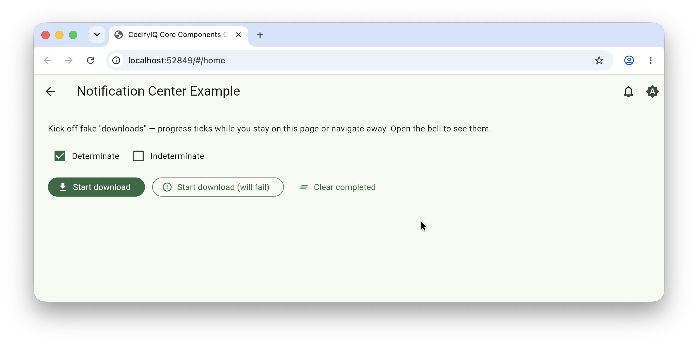

# codifyiq_notification_center

[](https://pub.dev/packages/codifyiq_notification_center)

A Play Store-style notification center for tracking long-running, user-initiated tasks
(uploads, downloads, multi-step background work) without blocking the UI.

## Demo
Select the image for a quick walkthrough:
[](https://drive.google.com/file/d/1uq70duvThCbSHBgxZn_wo_1Hfzs720Yq/view?usp=drive_link)

## Widgets

* `NotificationBellButton` — an `AppBar` action with a stoplight-coded Material 3 badge. Opens an
  anchored dropdown on wide viewports and a full-screen `NotificationCenterPage` on narrow ones.
* `NotificationCenterController` — a `ChangeNotifier` exposing `start` / `updateProgress` /
  `complete` / `fail` / `dismiss` / `clearCompleted` / `clearAll` / `markAllSeen`. The widget is
  UI-only; you drive it from your own task layer.
* `NotificationCenterPanel` / `NotificationCenterPage` — list view with **In progress**,
  **Failed**, and **Completed** sections.
* `NotificationCenterScope` — an `InheritedNotifier` for ambient controller lookup.

## Installation

```yaml
dependencies:
  codifyiq_notification_center: ^1.0.0
```

## Usage

```dart
import 'package:codifyiq_notification_center/codifyiq_notification_center.dart';

final controller = NotificationCenterController();

controller.start(id: 'job-1', title: 'Uploading invoice.pdf', progress: 0);
controller.updateProgress('job-1', progress: 0.42);
controller.complete(
  'job-1',
  description: 'Saved to Documents/invoice.pdf',
  action: NotificationItemAction(label: 'Open', onPressed: openFile),
);

AppBar(actions: [NotificationBellButton(controller: controller)]);
```

The bell is a **stoplight, not a count**: error → running → success → none, with the icon
swapping to a filled variant whenever items are tracked (state conveyed by shape as well as
color, per WCAG 1.4.1).

---

Part of the [CodifyIQ component family](https://github.com/CodifyIQ/codifyiq-core-components) · [pub.dev/publishers/codifyiq.com](https://pub.dev/publishers/codifyiq.com)
