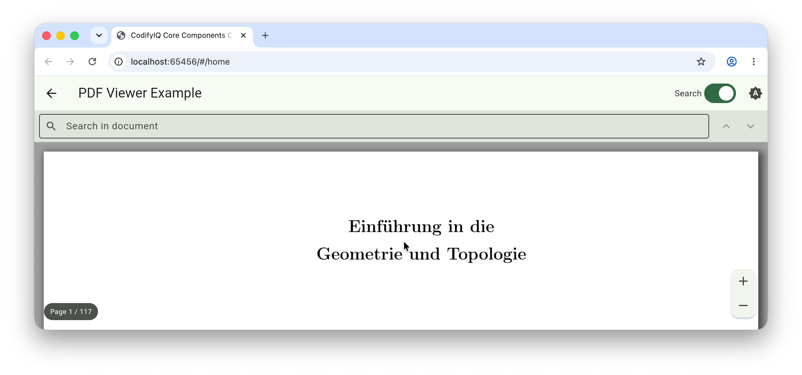

# codifyiq_pdf_viewer

[](https://pub.dev/packages/codifyiq_pdf_viewer)

A reusable PDF viewer backed by [`pdfrx`](https://pub.dev/packages/pdfrx). Renders a document from a network URI, a local file 
path, or in-memory bytes via a single `PdfSource` parameter.

## Demo
Select the image for a quick walkthrough:
[](https://drive.google.com/file/d/1AEjjMeh-RJJTUQ7mIArs1lDOepIlDDQ8/view?usp=drive_link)

## Features

* **Built-in search UI** — a Material search bar, debounced input, match counter, and
  next/previous controls that wrap around at both ends.
* **Consistent zoom bounds** — the `minScale` / `maxScale` you pass are honored by pinch,
  +/− buttons, and Ctrl/Cmd + scroll-wheel alike.
* **On-screen web zoom buttons** and a **page indicator overlay**.
* **A unified `PdfSource`** (value-equal variants) in place of `pdfrx`'s separate
  `.uri` / `.file` / `.data` constructors, so swapping documents at runtime diffs cleanly.
* **On-demand streaming for network PDFs** — opt in with `preferRangeAccess` to fetch only
  the byte ranges the viewport needs, so the first page of a large document renders without
  waiting for the whole file to download. Pair it with `useProgressiveLoading` (on by
  default) so later pages resolve before the download finishes instead of all at once.
* **Download progress** — a linear progress bar (determinate when the server sends a content
  length) is shown across the top of the viewer while a network PDF loads; opt out with
  `showDownloadProgress: false` or hook `onDownloadProgress` to drive your own UI.
* **Open to a page** — `initialPageNumber` opens the document to a specific page (deep links,
  resuming a reader), and `networkTimeout` bounds a stalled network load so it surfaces the
  error UI instead of spinning forever.

## Installation

```yaml
dependencies:
  codifyiq_pdf_viewer: ^1.1.0
```

## Usage

```dart
import 'package:codifyiq_pdf_viewer/codifyiq_pdf_viewer.dart';

PdfViewerWidget(
  source: PdfSource.uri(Uri.parse('https://example.com/file.pdf')),
  enableSearch: true,
  onDocumentLoaded: (pageCount) => debugPrint('Loaded $pageCount pages'),
);
```

Load from a local file or in-memory bytes with the other `PdfSource` variants:

```dart
PdfViewerWidget(source: PdfSource.file('/path/to/file.pdf'));
PdfViewerWidget(source: PdfSource.bytes(myUint8List));
```

## Authentication

For PDFs behind an authenticated endpoint, pass HTTP headers via `PdfSource.uri`:

```dart
PdfViewerWidget(
  source: PdfSource.uri(
    Uri.parse('https://api.example.com/documents/42.pdf'),
    headers: {'Authorization': 'Bearer $jwt'},
  ),
);
```

## Streaming large PDFs

Set `preferRangeAccess: true` on `PdfSource.uri` to render the first page after a single
small request instead of downloading the entire file first:

```dart
PdfViewerWidget(
  source: PdfSource.uri(
    Uri.parse('https://example.com/large-report.pdf'),
    preferRangeAccess: true,
  ),
);
```

The server must answer range requests with `206 Partial Content`; if it doesn't, `pdfrx`
falls back to a full download automatically, so enabling this is safe even when range
support is unknown. It's a load-time choice applied when the document first opens, and it
has no effect on web.

For a large, multi-page document you usually want range access **and** progressive loading
(the latter is on by default) so later pages render before the whole file arrives:

```dart
PdfViewerWidget(
  source: PdfSource.uri(
    Uri.parse('https://example.com/large-report.pdf'),
    preferRangeAccess: true,
    useProgressiveLoading: true, // default; shown for clarity
  ),
);
```

> **Requires a linearized PDF.** True page-by-page streaming only works when the document is
> **linearized** ("Fast Web View") — a layout that puts a hint table and the first page at the
> front of the file. A non-linearized PDF keeps its cross-reference table and object streams
> at the *end*, so pages past the first can't resolve until (essentially) the whole file has
> been fetched, even with `preferRangeAccess: true`. In that case you'll see the first page,
> then the rest appear together once the download completes. Linearize your PDFs at
> ingest/build time — e.g. `qpdf --linearize in.pdf out.pdf` — to get incremental page
> loading; it's a one-time step and doesn't change how they render otherwise.

> **Web note:** PDFs loaded via `PdfSource.uri` require the server to send appropriate CORS
> headers. `PdfSource.file` is not supported on the web platform.

---

Part of the [CodifyIQ component family](https://github.com/CodifyIQ/codifyiq-core-components) · [pub.dev/publishers/codifyiq.com](https://pub.dev/publishers/codifyiq.com)
