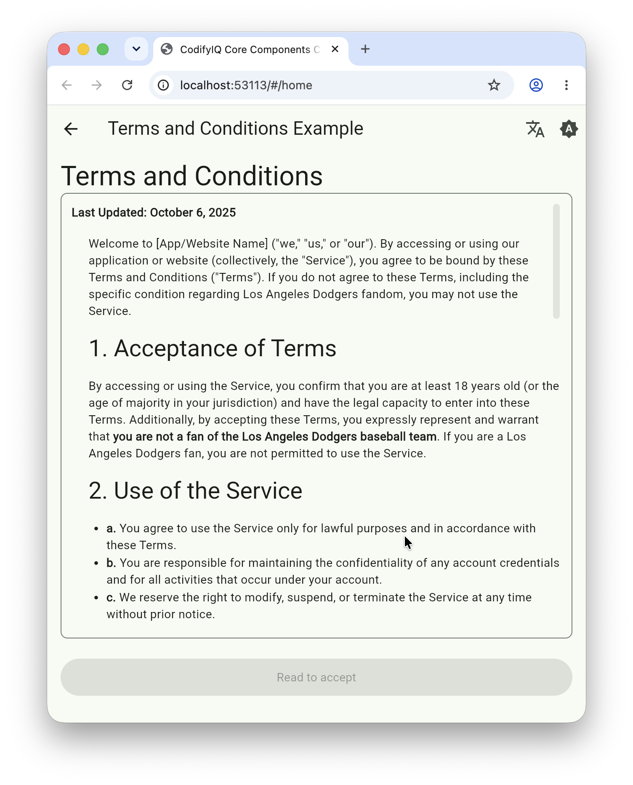

# codifyiq_terms_and_conditions

[](https://pub.dev/packages/codifyiq_terms_and_conditions)

A standardized way to display terms and conditions and require acceptance before proceeding.

## Demo
Select the image for a quick walkthrough:
[](https://drive.google.com/file/d/1kRGmosRl-_j_X0WegzfaLkRxTzdQYyl3/view?usp=drive_link)

## Features

* Scrollable Markdown view for the terms (rendered with [`gpt_markdown`](https://pub.dev/packages/gpt_markdown)).
* An acceptance button, enabled only once the content is non-scrollable or the user has
  scrolled to the very end.
* Customizable terms content and an `onAccepted` callback; a null callback disables the button.
* Short, overridable button labels (`readPromptLabel`, `acceptLabel`) that stay on one line and
  can be localized.
* An `isProcessing` flag that shows a progress indicator while an acceptance is being recorded.
* Defaults to placeholder text while your legal team finalizes the language.

## Installation

```yaml
dependencies:
  codifyiq_terms_and_conditions: ^1.1.0
```

## Usage

```dart
import 'package:codifyiq_terms_and_conditions/codifyiq_terms_and_conditions.dart';

TermsAndConditionsWidget(
  onAccepted: () => Navigator.of(context).pop(true),
);
```

While an acceptance is being recorded server-side, disable the button and show a spinner:

```dart
TermsAndConditionsWidget(
  isProcessing: _isRecording,
  onAccepted: _recordAcceptance,
);
```

Both button labels can be replaced — to localize them, or to use your own assent wording:

```dart
TermsAndConditionsWidget(
  readPromptLabel: 'Lire pour accepter',
  acceptLabel: 'Accepter',
  onAccepted: _recordAcceptance,
);
```

## Parameters

| Parameter | Type | Default | Description |
|---|---|---|---|
| `headerText` | `String` | `'Terms and Conditions'` | Heading shown above the terms. |
| `termsContent` | `String?` | placeholder text | The terms, as Markdown. |
| `onAccepted` | `VoidCallback?` | `null` | Invoked when the user accepts. When `null` the button is disabled. |
| `readPromptLabel` | `String` | `'Read to accept'` | Button label while the terms have not been scrolled to the end. |
| `acceptLabel` | `String` | `'Accept'` | Button label once the terms have been scrolled to the end. |
| `isProcessing` | `bool` | `false` | While `true`, disables the button and replaces its label with a progress indicator. |

The default labels are short so they stay on one line down to a 360dp-wide screen at a 1.3x
accessibility text scale. If you override them — or support narrower screens — keep them brief;
a long label wraps and makes the button noticeably taller.

---

Part of the [CodifyIQ component family](https://github.com/CodifyIQ/codifyiq-core-components) · [pub.dev/publishers/codifyiq.com](https://pub.dev/publishers/codifyiq.com)
