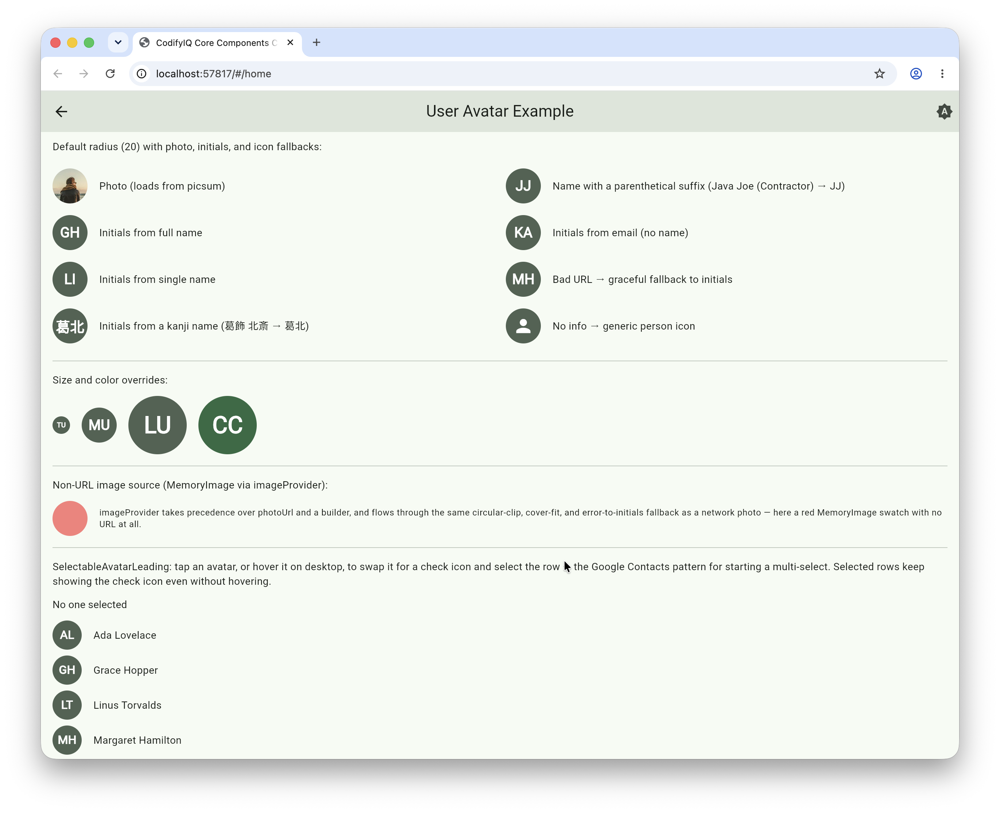

# codifyiq_user_avatar

[](https://pub.dev/packages/codifyiq_user_avatar)

A circular user avatar with graceful fallbacks: it shows a photo when available, falls back to
the user's initials, and finally to a placeholder icon.

## Demo
Select the image for a quick walkthrough:
[](https://drive.google.com/file/d/1CuqSiLByZsKK_tYSO-UuiFwFWUIl3Tes/view?usp=drive_link)

## Installation

```yaml
dependencies:
  codifyiq_user_avatar: ^1.1.0
```

## Usage

```dart
import 'package:codifyiq_user_avatar/codifyiq_user_avatar.dart';

UserAvatar(
  photoUrl: user.photoUrl,
  displayName: user.displayName,
  radius: 24,
);
```

### Non-URL image sources

To use an image you already hold in memory or on disk (not a URL), pass an
`imageProvider`. It takes precedence over `photoUrl`/`imageProviderBuilder` and
flows through the same circular clip, cover fit, and initials fallback:

```dart
UserAvatar(imageProvider: MemoryImage(bytes), displayName: user.displayName);
```

In list contexts, hold a stable `MemoryImage` instance (it compares bytes by
identity) so the image cache can dedupe it across rebuilds.

### Bulk-selectable list rows

`SelectableAvatarLeading` wraps a `UserAvatar` as a list row's leading control:
tap it, or hover it on desktop, to swap the avatar for a check icon and report
the selection — the Google Contacts pattern for starting a multi-select
without dedicating a whole column to checkboxes up front. It accepts the same
`displayName` / `email` / `photoUrl` / `imageProvider` / `radius` as
`UserAvatar`, plus `selected` and `onChanged`:

```dart
Row(
  children: [
    SelectableAvatarLeading(
      displayName: user.name,
      selected: selectedIds.contains(user.id),
      onChanged: (checked) => setState(() {
        if (checked) {
          selectedIds.add(user.id);
        } else {
          selectedIds.remove(user.id);
        }
      }),
    ),
    const SizedBox(width: 12),
    Expanded(child: Text(user.name)),
  ],
);
```

---

Part of the [CodifyIQ component family](https://github.com/CodifyIQ/codifyiq-core-components) · [pub.dev/publishers/codifyiq.com](https://pub.dev/publishers/codifyiq.com)
